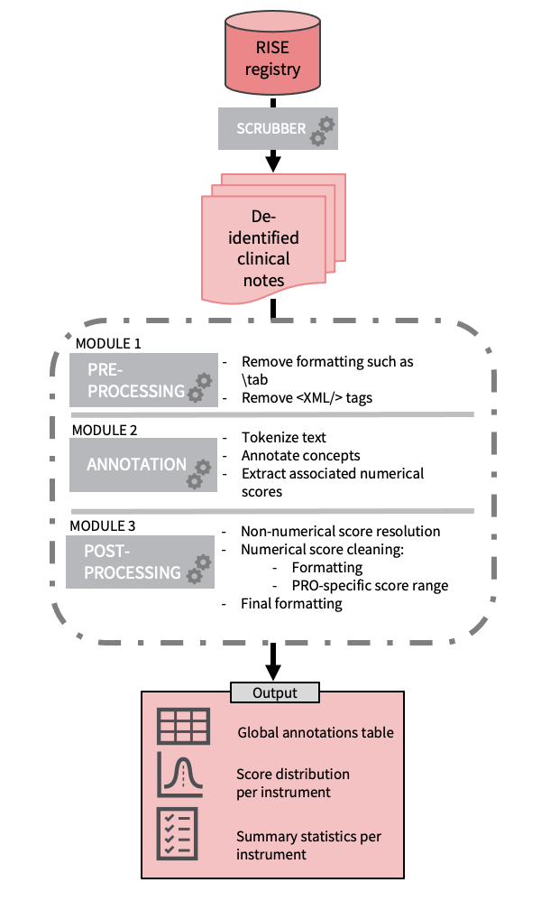

# RISE_PROS

Code accompanying the following manuscript [**Development of a Natural Language Processing System for Extracting Rheumatoid Arthritis Outcomes from Clinical Notes using the National RISE Registry**](https://onlinelibrary.wiley.com/doi/epdf/10.1002/acr.24869)

<br /><br />



<br /><br />

> __Usability note:__ This is experimental work, not a directly usable software library.
The code was developed in the context of an academic research project, highly
exploratory and iterative in nature. It is published here in the spirit of
open science and reproducibility values.

<br /><br />

## Getting started


### Prerequisite

The project was built using the Anaconda distribution of python 3.6.13. To run the code, clone this repository and use the Anaconda environment manager to create an environment using the `environment.yml` file to install the tagger code dependencies.

## How to run
To run the tagger, run a succession of 4 scripts to extract RA Outcome measures from the notes. In the src/ folder:
1. In the src/ folder, update HP.py to fit your local variables
2. The first step creates the PhraseMatcher using the terminologies found in res/ and extracts mentions and scores
```
python extract_pros.py > extract_pros.out
```
3. The second step resolves non-numerical scores
```
python get_score_resolution.py > get_score_resolution.out
```
4. The third step cleans up double occurences and ... (add more details)
```
python clean_extractions.py > clean_extractions.out
```
5. The final step cleans meaningless scores and outputs a table with mentions/score statistics as well as a figure with score distribution for a chosen instrument
```
python resolve_fractional_score.py
```


## License

This project is licensed under the MIT License - see the [LICENSE.md](LICENSE.md) file for details
